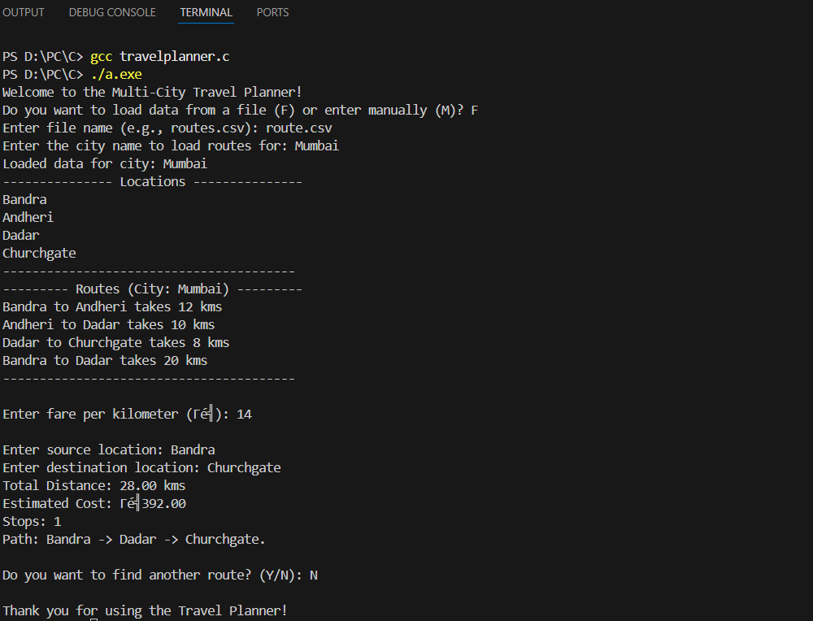

🗺️ Travel Planner – C Language
A C-based trip planning tool that calculates the shortest route, estimates total fare, and displays the travel path — all powered by Dijkstra’s shortest-path algorithm.

✨ Features
 
🚗 Shortest Path Finder – Calculates the most efficient route between destinations.
 
💰 Real-Time Fare Estimation – Calculates total journey cost based on distance and per-kilometer rate.
 
📍 Route Visualization – Displays the complete travel path in an easy-to-read format.
 
📂 Flexible Input – Supports both CSV file import and manual route entry.

 
🛠️ Tech Stack
Language: C
 

Algorithm: Dijkstra’s Algorithm
 

Data Input: CSV / Manual

 

Source: Dehradun
 
Destination: Mussoorie
 
Total Distance: 33.20 kms
 
Estimated Cost: ₹332.00
 
Path: Dehradun -> Rajpur -> Mussoorie
 

 

📦 Installation & Usage
Clone the repository

 
git add image.png
git commit -m "Add screenshot"
git push

 

## 📸 Screenshot

 

./travel_planner
 

📈 Future Enhancements
 

🖥️ GUI-based interface for better visualization.
 

🌍 Support for multiple fare rates and transportation modes.
 

📊 Export routes and fare details as a PDF report.
 

📜 License
This project is licensed under the MIT License.

If you want, I can make the actual README.md file for you with Markdown formatting, emojis, and proper sections so you can just drop it into your GitHub repo and it will look polished instantly.
